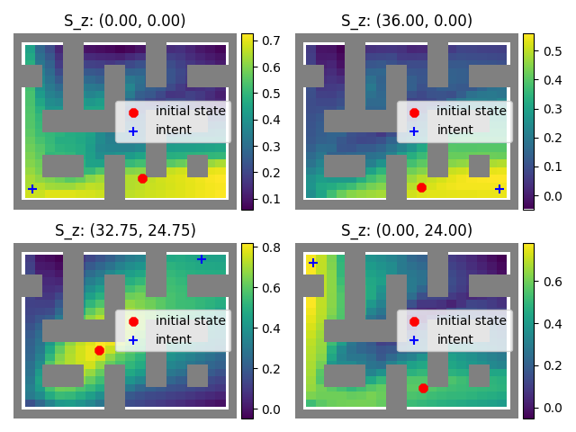
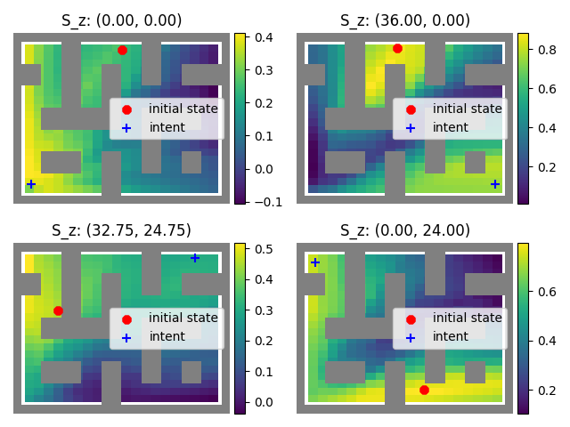

Run different configs from `configs` folder with 
```
python main.py --flagfile=configs.antmaze-large_icvf.cfg
```
## Installation

```

# Install CALVIN (optional)
# Download `calvin.gz` (dataset) following the instructions at https://github.com/clvrai/skimo and place it in the `data` directory.
cd calvin
./install.sh

# Install Procgen (optional)
# Download `level500.npz` (dataset) from https://drive.google.com/file/d/1l1yHwzCYxHdgnW55R5pyhKFzHFqIQiQC/view and place it in the `data/procgen` directory.
# Download `level1000.npz` (dataset) from https://drive.google.com/file/d/19MqYZUENWWP7dHzlZFKhdVnouSxqfl5A/view and place it in the `data/procgen` directory.
pip install procgen
```

## Examples

```
# HIQL on antmaze-large-diverse
python main.py --run_group EXP --seed 0 --env_name antmaze-large-diverse-v2 --pretrain_steps 1000002 --eval_interval 100000 --save_interval 250000 --p_currgoal 0.2 --p_trajgoal 0.5 --p_randomgoal 0.3 --discount 0.99 --temperature 1 --high_temperature 1 --pretrain_expectile 0.7 --geom_sample 1 --use_layer_norm 1 --value_hidden_dim 512 --value_num_layers 3 --batch_size 1024 --use_rep 1 --policy_train_rep 0 --rep_dim 10 --rep_type concat --algo_name hiql --use_waypoints 1 --way_steps 25 --high_p_randomgoal 0.3
# HIQL (w/o repr.) on antmaze-large-diverse
python main.py --run_group EXP --seed 0 --env_name antmaze-large-diverse-v2 --pretrain_steps 1000002 --eval_interval 100000 --save_interval 250000 --p_currgoal 0.2 --p_trajgoal 0.5 --p_randomgoal 0.3 --discount 0.99 --temperature 1 --high_temperature 1 --pretrain_expectile 0.7 --geom_sample 1 --use_layer_norm 1 --value_hidden_dim 512 --value_num_layers 3 --batch_size 1024 --use_rep 0 --policy_train_rep 0 --algo_name hiql --use_waypoints 1 --way_steps 25 --high_p_randomgoal 0.3

# HIQL on antmaze-ultra-diverse
python main.py --run_group EXP --seed 0 --env_name antmaze-ultra-diverse-v0 --pretrain_steps 1000002 --eval_interval 100000 --save_interval 250000 --p_currgoal 0.2 --p_trajgoal 0.5 --p_randomgoal 0.3 --discount 0.99 --temperature 1 --high_temperature 1 --pretrain_expectile 0.7 --geom_sample 1 --use_layer_norm 1 --value_hidden_dim 512 --value_num_layers 3 --batch_size 1024 --use_rep 1 --policy_train_rep 0 --rep_dim 10 --rep_type concat --algo_name hiql --use_waypoints 1 --way_steps 50 --high_p_randomgoal 0.3
# HIQL (w/o repr.) on antmaze-ultra-diverse
python main.py --run_group EXP --seed 0 --env_name antmaze-ultra-diverse-v0 --pretrain_steps 1000002 --eval_interval 100000 --save_interval 250000 --p_currgoal 0.2 --p_trajgoal 0.5 --p_randomgoal 0.3 --discount 0.99 --temperature 1 --high_temperature 1 --pretrain_expectile 0.7 --geom_sample 1 --use_layer_norm 1 --value_hidden_dim 512 --value_num_layers 3 --batch_size 1024 --use_rep 0 --policy_train_rep 0 --algo_name hiql --use_waypoints 1 --way_steps 50 --high_p_randomgoal 0.3

# HIQL on kitchen-mixed
python main.py --run_group EXP --seed 0 --env_name kitchen-mixed-v0 --pretrain_steps 500002 --eval_interval 100000 --save_interval 250000 --p_currgoal 0.2 --p_trajgoal 0.5 --p_randomgoal 0.3 --discount 0.99 --temperature 1 --high_temperature 1 --pretrain_expectile 0.7 --geom_sample 1 --use_layer_norm 1 --value_hidden_dim 512 --value_num_layers 3 --batch_size 1024 --use_rep 1 --policy_train_rep 0 --rep_dim 10 --rep_type concat --algo_name hiql --use_waypoints 1 --way_steps 25 --high_p_randomgoal 0.3
# HIQL (w/o repr.) on kitchen-mixed
python main.py --run_group EXP --seed 0 --env_name kitchen-mixed-v0 --pretrain_steps 500002 --eval_interval 100000 --save_interval 250000 --p_currgoal 0.2 --p_trajgoal 0.5 --p_randomgoal 0.3 --discount 0.99 --temperature 1 --high_temperature 1 --pretrain_expectile 0.7 --geom_sample 1 --use_layer_norm 1 --value_hidden_dim 512 --value_num_layers 3 --batch_size 1024 --use_rep 0 --policy_train_rep 0 --algo_name hiql --use_waypoints 1 --way_steps 25 --high_p_randomgoal 0.3

# HIQL on calvin
python main.py --run_group EXP --seed 0 --env_name calvin --pretrain_steps 500002 --eval_interval 100000 --save_interval 250000 --p_currgoal 0.2 --p_trajgoal 0.5 --p_randomgoal 0.3 --discount 0.99 --temperature 1 --high_temperature 1 --pretrain_expectile 0.7 --geom_sample 1 --use_layer_norm 1 --value_hidden_dim 512 --value_num_layers 3 --batch_size 1024 --use_rep 1 --policy_train_rep 0 --rep_dim 10 --rep_type concat --algo_name hiql --use_waypoints 1 --way_steps 25 --high_p_randomgoal 0.3
# HIQL (w/o repr.) on calvin
python main.py --run_group EXP --seed 0 --env_name calvin --pretrain_steps 500002 --eval_interval 100000 --save_interval 250000 --p_currgoal 0.2 --p_trajgoal 0.5 --p_randomgoal 0.3 --discount 0.99 --temperature 1 --high_temperature 1 --pretrain_expectile 0.7 --geom_sample 1 --use_layer_norm 1 --value_hidden_dim 512 --value_num_layers 3 --batch_size 1024 --use_rep 0 --policy_train_rep 0 --algo_name hiql --use_waypoints 1 --way_steps 25 --high_p_randomgoal 0.3

# HIQL on procgen-500
python main.py --run_group EXP --seed 0 --env_name procgen-500 --pretrain_steps 500002 --eval_interval 50000 --save_interval 250000 --p_currgoal 0.2 --p_trajgoal 0.5 --p_randomgoal 0.3 --discount 0.99 --temperature 1 --high_temperature 1 --pretrain_expectile 0.7 --geom_sample 1 --use_layer_norm 1 --value_hidden_dim 512 --value_num_layers 3 --batch_size 256 --visual 1 --encoder impala --use_rep 1 --policy_train_rep 1 --rep_dim 10 --rep_type concat --algo_name hiql --use_waypoints 1 --way_steps 3 --high_p_randomgoal 0

```

# ICVF on AntMaze Large-diverse

